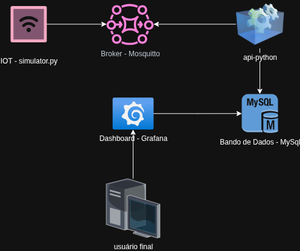

# 🛰️ Projeto IoT com Mosquitto (MQTT)

Este projeto utiliza o **Eclipse Mosquitto** como broker MQTT, com autenticação configurável via arquivo `passwd`.

---

## 🚀 Como executar

Para iniciar o ambiente, execute o comando abaixo:

```bash
docker compose up --build
```
## OBS: Aguardar entre 1 e 2 minutos para visualizar os dados no grafana

## Dados Grafana
```
host: localhost:3000
usuário: admin
senha: admin
```

# helps

### container moquitto
```
touch /mosquitto/config/passwd
docker exec mosquitto chmod 0700 /mosquitto/config/passwd
docker exec eclipse-mosquitto mosquitto_passwd -b /mosquitto/config/passwd iotuser iotpass
```

## 🧩 Arquitetura dos dispositivos

Abaixo está o diagrama da arquitetura IoT utilizada no projeto:



## 📊 Logs e visualização no Grafana

Exemplo de visualização dos logs no Grafana e dos Apps:

